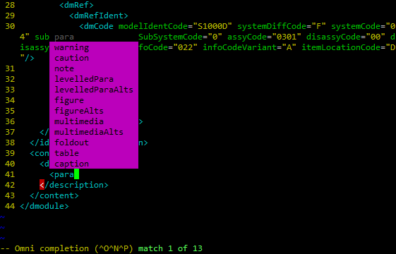

These are a set of OmniComplete dictionaries and scripts for Vim to
enable schema-aware auto-complete for S1000D XML. They are generated
automatically from the official S1000D XML schemas.



# Installing

This repository includes pre-built Omnicomplete dictionaries for S1000D
Issue 2.3 thru 5.0. To install them, copy the contents of the `vim`
directory to your Vim configuration directory (e.g., `~/.vim`).

For example, after installation, your Vim directory would look like this:
```
...
~/.vim/autoload/xml/S1000D_[...]_[...].vim
...
~/.vim/ftdetect/S1000D.vim
...
```

# Using


To enable Omni completion in Vim, refer to
https://vim.fandom.com/wiki/Omni_completion. The default method of
activating Omnicomplete is using ^X^O (Ctrl-X Ctrl-O) in Insert mode.

# Building

Requirements:

- S1000D XML schemas
- xsltproc (part of [libxml2](http://www.xmlsoft.org/))

To rebuild the Omnicomplete dictionaries from the S1000D XML schemas:

1. Download the required S1000D XML schemas from http://s1000d.org/Downloads/Pages/S1000DDownloads.aspx

2. Copy the S1000D XML schemas to the provided `schemas` directory, using the following path structure:

    ```
    schemas/S1000D_[major]-[minor]/xml_schema_flat/[schema].xsd
    ```

    For example:

    ```
    schemas/S1000D_5-0/xml_schema_flat/proced.xsd
    schemas/S1000D_4-1/xml_schema_flat/descript.xsd
    schemas/S1000D_3-0/xml_schema_flat/fault.xsd
    ```
3. Run `sh build.sh`
